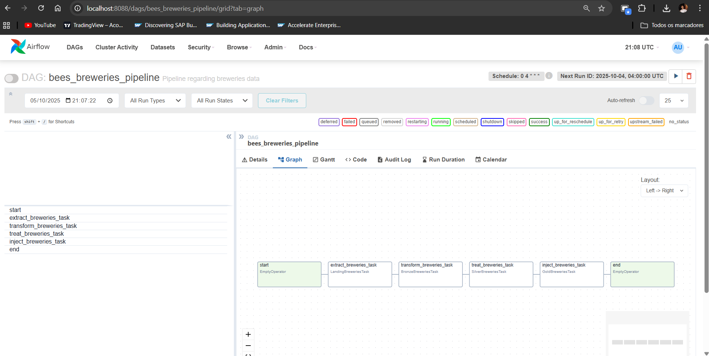
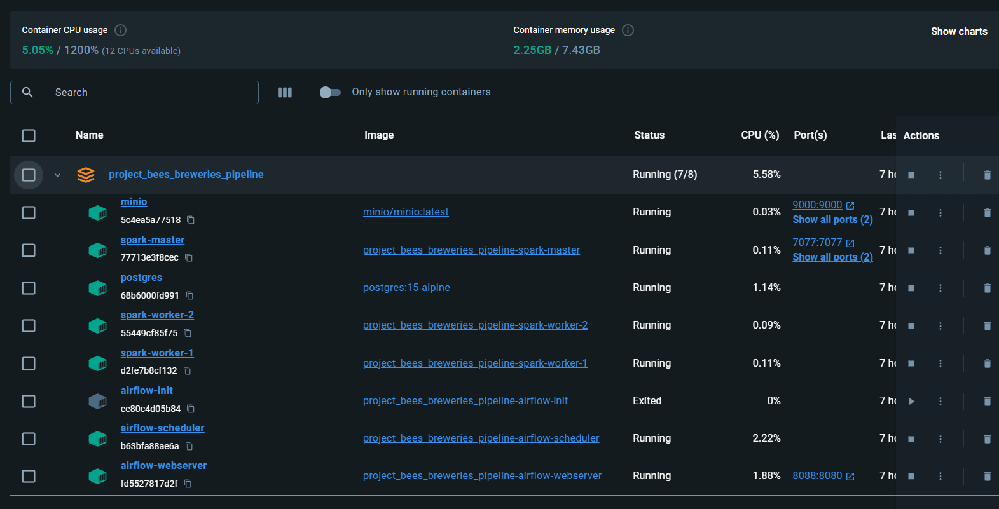
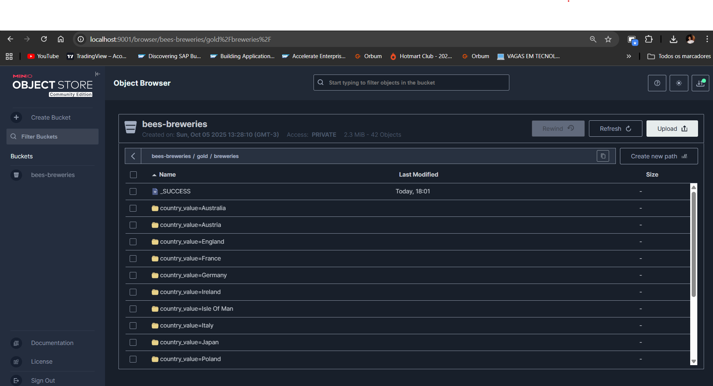

# project_bees_breweries_pipeline

This project aims to build a data pipeline using **Apache Airflow**, **PySpark**, and **MinIO** to create all the steps of an ETL, based on API data: [Open Brewery DB API](https://api.openbrewerydb.org).
Structured layers:

- **Landing**: data extraction
- **Bronze**: normalization data to .parquet
- **Silver**: data processing and data quality assurance
- **Gold**: aggregation of metrics for analytical visualization

## Technologies used

- Python 3.11+
- Apache Airflow 2.9+
- Apache Spark 3.5+
- Hadoop AWS connector (for S3/MinIO integration)
- MinIO (S3-compatible storage)
- Docker / Docker Compose

## Project Initialization

### 1. Clone the repository
```bash
git clone https://github.com/hannieltales12/project_bees_breweries_pipeline.git
cd project_bees_breweries_pipeline
```

### 2. Build the Docker images
Build the custom **Spark image** with Hadoop AWS support:
```bash
docker build -t spark:3.5.3 -f ./docker/spark/Dockerfile .
```

Then build the **Airflow image**:
```bash
docker build -t airflow:bees-pipeline -f ./docker/airflow/Dockerfile .
```

### 3. Start the containers
```bash
docker compose up -d
```

This command will start the following services:
- **airflow-webserver** – Airflow UI
- **airflow-scheduler** – DAG scheduler
- **spark-master** – Spark driver node
- **spark-worker** – Spark executor node
- **minio** – object storage for the data lake

## Access Points

### Airflow UI
```
http://localhost:8088
```
Default credentials:
```
User: admin
Password: admin
```

### MinIO Console
```
http://localhost:9001
```
Default credentials:
```
Access Key: minioadmin
Secret Key: minioadmin
```

### Spark Master UI
```
http://localhost:8080
```
(If port conflicts occur, adjust in `docker-compose.yml`.)

## Directory Structure

```
project_bees_breweries_pipeline/
│
├── airflow/
│   ├── dags/
│   │   └── bees_breweries_pipeline/
│   │       ├── flow/
│   │       │   └── dag.py
│   │       └── tasks/
│   │           ├── landing_breweries_task.py
│   │           ├── bronze_breweries_task.py
│   │           ├── silver_breweries_task.py
│   │           └── gold_breweries_task.py
│   ├── tools/
│   │   └── const/
│   │       ├── breweries_package.py
│   │       ├── pipeline.py
│   │       └── schema_tables.py
│   ├── Dockerfile
│   └── requirements.txt
│
├── spark/
│   ├── Dockerfile
│   └── docker-entrypoint.sh
│
├── jars/                                   # Custom JARs for Spark (if needed)
├── logs/                                   # Airflow and Spark logs
├── plugins/                                # Optional Airflow plugins
├── .storage/                               # Local storage for development
│   ├── landing/
│   ├── bronze/
│   ├── silver/
│   └── gold/
│
├── resources/                              # Screenshots and visual references
│   ├── airflow.png
│   ├── docker.png
│   └── minio.png
│
├── docker-compose.yml                      # Container orchestration
├── .gitignore
└── README.md
```

## Pipeline Overview

### Landing Layer
- Extracts data from the Open Brewery DB API using pagination.
- Saves raw JSON files in `/opt/airflow/.storage/landing/<dag_id>/breweries.json`.

### Bronze Layer
- Reads the landing JSON data.
- Converts it to Parquet format and stores it in **MinIO** (`s3a://bees-breweries/bronze/`).

### Silver Layer
- Cleans null values in string and numeric columns:
  - Converts `null` in text columns to empty strings.
  - Converts `null` in numeric columns to `0.0`.
- Applies trimming to remove extra spaces (e.g., `" United States"` → `"United States"`).
- Saves the standardized data to **MinIO** (`s3a://bees-breweries/silver/`), partitioned by:
  ```
  country
  ```

### Gold Layer
- Reads the Silver layer.
- Aggregates the number of breweries per type and location:
  ```python
  groupBy("country", "state_province", "city", "brewery_type")
  .agg(count("*").alias("total_breweries"))
  ```
- Saves the aggregated view at parquet to **MinIO** (`s3a://bees-breweries/gold/breweries_per_type_location/`), partitioned by:
  ```
  country
  ```


## Running the Pipeline

1. Start all containers:
   ```bash
   docker compose up -d
   ```

2. Access the Airflow UI at [http://localhost:8088](http://localhost:8088).

3. Enable the DAG named `bees_breweries_pipeline`.

4. Trigger a manual run or wait for the scheduled execution.

## Stopping the Environment

```bash
docker compose down
```

To rebuild everything from scratch:
```bash
docker compose down -v
docker compose up -d --build
```

## Screenshots

Below are some screenshots of the project running successfully:

### Airflow


### Docker


### MinIO
